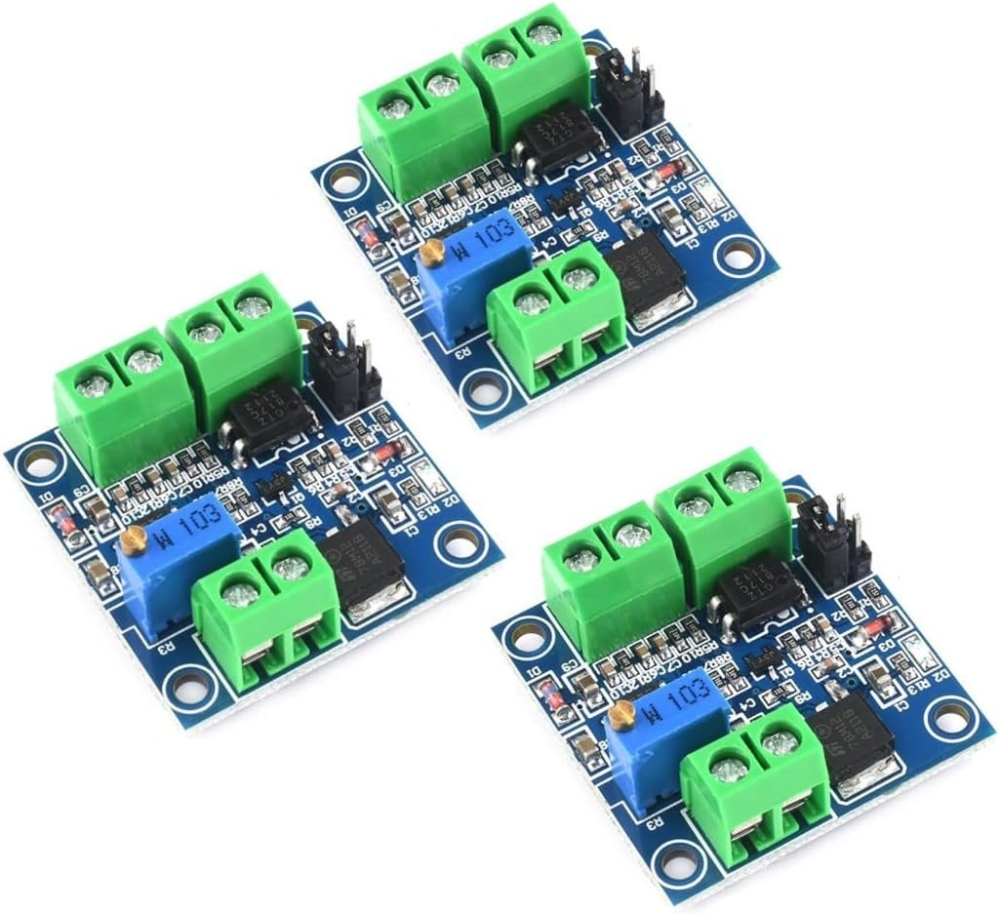

# JZ-PWM2 — двухканальный UART-управляемый генератор PWM

Неофициальная русскоязычная документация, результаты проверки и примеры интеграции китайского модуля с маркировкой **JZ-PWM\*2**.

## Назначение репозитория

Репозиторий собирает в одном месте:

- русскоязычное руководство по эксплуатации;
- описание UART-протокола `9600 8N1`;
- распиновку и требования к электрическому подключению;
- примеры управления с ПК, Arduino и ESP32;
- план стендовой проверки недокументированных особенностей;
- журнал подтвержденных и неподтвержденных характеристик.

## Быстрый старт

1. Подайте питание 5–30 В на силовой вход либо 5 В через Micro-USB.
2. Соедините общую землю управляющего устройства и модуля.
3. Подключите `TX` контроллера к `RXD` модуля, а `RX` контроллера — к `TXD` модуля.
4. До подключения к 3,3-вольтовому контроллеру измерьте уровень `TXD` модуля. При уровне 5 В примените преобразователь уровней или делитель.
5. Настройте UART: `9600 бод, 8 бит, без четности, 1 стоп-бит, без управления потоком`.
6. Отправьте, например, `S1F100T` для установки частоты PWM1 равной 100 Гц.

## Подтвержденные команды

| Команда | Назначение |
|---|---|
| `S1F100T` | установить PWM1: 100 Гц |
| `S2F100T` | установить PWM2: 100 Гц |
| `S1F54.1T` | установить PWM1: 54,1 кГц |
| `S1D025T` | установить PWM1: заполнение 25% |
| `S2D075T` | установить PWM2: заполнение 75% |

Документация продавца указывает ответы `DOWN` при успехе и `FALL` при ошибке. Команды чтения текущих параметров не документированы.

## Важные ограничения

- Это **сигнальный**, а не силовой модуль. Заявленный выходной ток — менее 30 мА.
- Не используйте PWM-выход напрямую для двигателя, нагревателя, мощной лампы или светодиодной ленты.
- Заявленная точность частоты около ±2%; модуль не является измерительным генератором.
- Программное отключение через 0% не подтверждено. Для ответственных применений используйте отдельный аппаратный `ENABLE`.
- Формат команды для диапазона 100–150 кГц требует проверки на реальном экземпляре.
- Настройки энергонезависимы: после включения модуль может восстановить ранее заданный PWM.

## Документация

- [Руководство по эксплуатации, PDF](docs/releases/JZ-PWM2_Rukovodstvo_po_ekspluatacii_v1.0.pdf)
- [Редактируемый исходник, DOCX](docs/releases/JZ-PWM2_Rukovodstvo_po_ekspluatacii_v1.0.docx)
- [UART-протокол](docs/ru/uart-protocol.md)
- [Интеграция в микроконтроллерную систему](docs/ru/integration-guide.md)
- [План аппаратной проверки](docs/ru/verification-plan.md)
- [Неопределенности и статус сведений](docs/ru/known-uncertainties.md)
- [Распиновка](hardware/pinout.md)

## Примеры

- [`software/python`](software/python) — формирование команд и обмен через `pyserial`;
- [`software/arduino`](software/arduino) — пример для Arduino;
- [`software/esp32`](software/esp32) — пример для ESP32 с аппаратным UART.

## Статус

Версия структуры: **0.1.0**. Документация является независимой реконструкцией по материалам продавца и испытаниям экземпляров. Это не официальный документ производителя.

## Лицензия

Лицензия пока не выбрана. До добавления файла `LICENSE` материалы не следует считать автоматически предоставленными по открытой лицензии.
